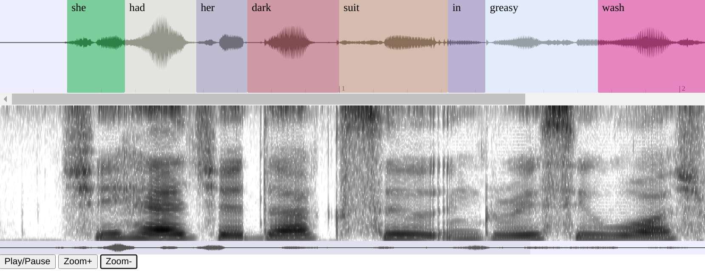

# wavesurfer-spectrogram-emu

This is a spectrogram plugin for [wavesurfer.js](https://github.com/katspaugh/wavesurfer.js)

It is an alternative to the original plugin that is different in several ways:

* this plugin uses the codebase of the excellent [EMU-web-app](https://github.com/IPS-LMU/EMU-webApp) project to draw the spectrogram
* the visuals are much more similar to something like [Praat](https://www.praat.org) so it should appeal more to phoneticians and researchers
  * the original seems to look more like the popular open source program [Audacity](https://v2-audacity.com/), which is fine, but different
* this plugin uses a background web-worker to redraw only the portion of the audio visible on screen
  * the original renders the spectrogram of the whole audio in a large image object and scrolls through the image in parallel with the audio
* this means that this plugin should be more efficient for large audio files
  * the original is generally more responsive and interactive for regular size files

## Screenshot

## How to use

Simply copy the plugin from the `dist/plugins` directory to your desired location and include it in your project in the same way as any other wavesurfer plugin.

A simple example is given in the `examples` directory.

## How to build

The plugin in the dist directory was built using the original project repository: [wavesurfer.js](https://github.com/katspaugh/wavesurfer.js)

Copy the contents of the `src` directory into the same directory of the original project and build the whole project using the instructions there.

